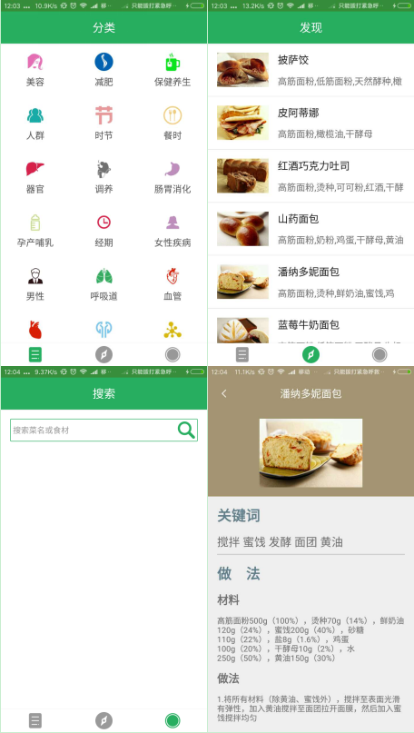

#### [微信小程序版点这里](https://github.com/bestTao/caipu_weixin)
# Android App--健康菜谱

基于Android的一个查找检索菜谱的应用

### 功能

* 分类检索菜谱

* 发现最新菜谱

* 根据菜谱名搜索菜谱

### 项目技术
* Google MVVM 架构：[Data Binding Library](https://developer.android.com/topic/libraries/data-binding/index.html)

* Retrofit+RxJava的网络请求，参考：[RxJava 与 Retrofit 结合的最佳实践](http://gank.io/post/56e80c2c677659311bed9841)

* 共享元素动画

* [Palette取图片主色](https://github.com/bestTao/caipu_android/blob/master/app/src/main/java/com/qiantao/caicai/activity/CookDetailsActivity.java#L38)
* RecyclerView及自定义的[ItemDecoration](https://github.com/bestTao/caipu_android/blob/master/app/src/main/java/com/qiantao/caicai/view/ItemDivider.java)

* API来源：[天狗云API](http://www.tngou.net/doc/cook)

### 效果
界面详情：

演示：

